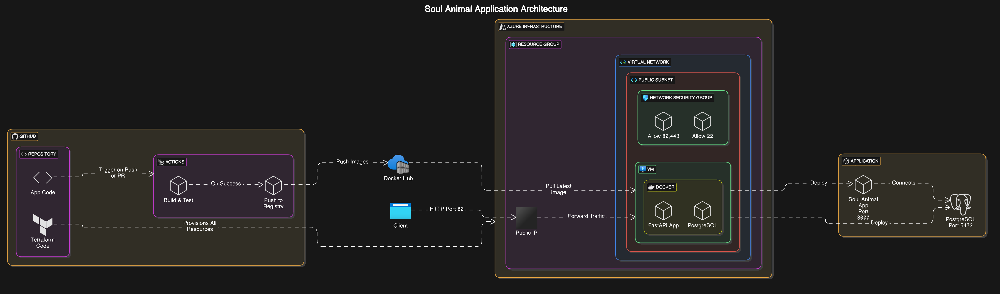
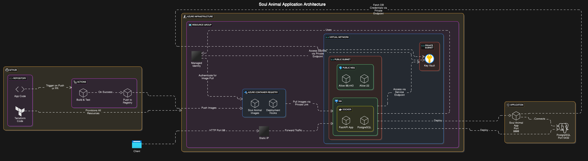

# Soul Animal Application

A FastAPI-based application deployed on Azure using Infrastructure as Code and CI/CD practices.

## Architecture

### Current Implementation

This architecture shows our current implementation with:
- Single VM deployment in public subnet
- Docker-based application deployment
- GitHub Actions CI/CD pipeline
- Infrastructure as Code using Terraform

### Future Implementation (with Enhanced Security)

The enhanced architecture includes:
- Private subnet for sensitive resources
- Azure Key Vault integration
- Managed Identity for secure access
- Network Security Groups with specific rules

## Infrastructure Components

- **Azure Resources**:
  - Virtual Network with Public/Private Subnets
  - Network Security Groups
  - Virtual Machine
  - Public IP (Static)
  - Key Vault (planned)
  - Managed Identity (planned)

- **Application Components**:
  - FastAPI Application (Port 8000)
  - PostgreSQL Database (Port 5432)
  - Docker Runtime Environment

## CI/CD Pipeline

Our GitHub Actions workflow:
1. Triggers on push/PR to `demo` branch
2. Builds Docker image
3. Pushes to Docker Hub
4. Tags with commit hash and latest
