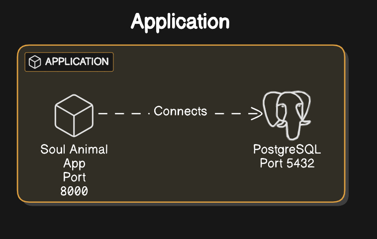
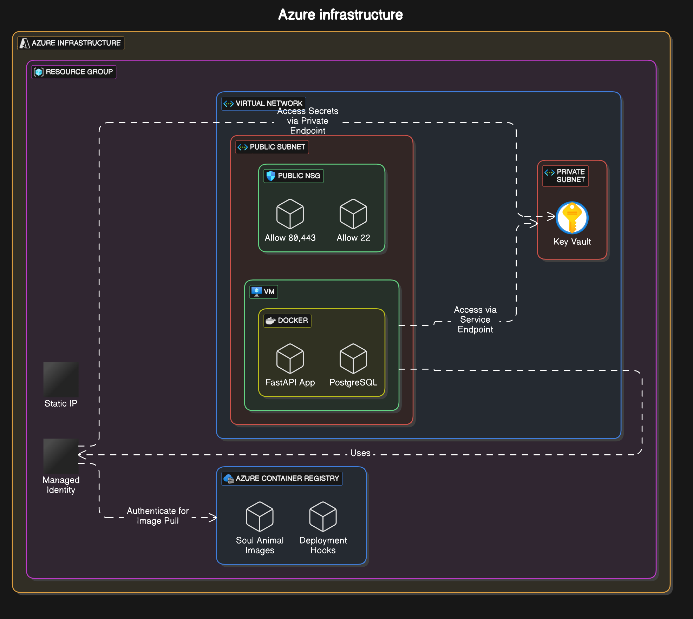
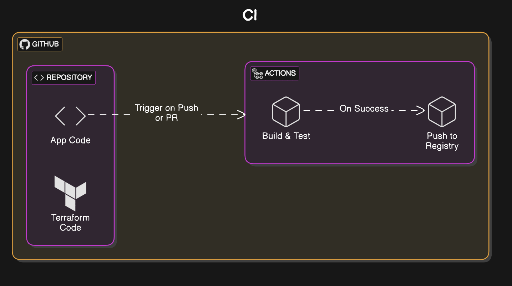

# Soul Animal Application

A FastAPI-based application deployed on Azure using Infrastructure as Code and CI/CD practices.

## Architecture

### Current Implementation

This architecture shows our current implementation with:
- Single VM deployment in public subnet
- Docker-based application deployment
- GitHub Actions CI/CD pipeline
- Docker Hub container registry
- Infrastructure as Code using Terraform

### Future Implementation (with Enhanced Security)

### Components

### Application Architecture

This diagram illustrates the core application components and their interactions:
- FastAPI backend service
- PostgreSQL database layer
- Docker containerization
- API endpoints and routing
- Data flow between components

### Azure Infrastructure

Detailed view of our Azure resource configuration:
- Virtual Network setup
- Subnet configuration
- Security group placement
- Resource relationships
- Network topology

### CI/CD Pipeline Flow

Visual representation of our continuous integration pipeline:
- GitHub Actions workflow stages
- Build and test processes
- Container image creation
- Deployment steps
- Quality gates

The enhanced architecture includes several security improvements:

#### Network Segmentation
- **Public Subnet**:
  - Hosts the VM with application containers
  - Configured with NSG rules for ports 80, 443, and 22
  - Direct internet access for application serving

- **Private Subnet**:
  - Hosts sensitive services (Key Vault)
  - Restricted access via Service Endpoints
  - No direct internet access
  - NSG rules limiting access to VM only

#### Azure Container Registry (ACR)
- Private container image storage
- Built-in vulnerability scanning
- Integration with Azure services
- Managed Identity authentication
- Private Link connectivity
- Deployment webhooks

#### Azure Key Vault
- Secure secrets management
- Database credentials storage
- SSL certificate management
- Private Endpoint access
- RBAC integration
- Audit logging

#### Managed Identity
- Passwordless authentication
- Access to Azure services:
  - Key Vault secrets
  - ACR image pulling
  - Other Azure resources
- Automated credential rotation
- Enhanced security posture

## Infrastructure Components

### Azure Resources
- Virtual Network (10.0.0.0/16)
  - Public Subnet (10.0.1.0/24)
  - Private Subnet (10.0.2.0/24)
- Network Security Groups
  - Public NSG (80, 443, 22)
  - Private NSG (VM access only)
- Virtual Machine
  - Docker runtime
  - Application containers
- Public IP (Static)
- Azure Container Registry
- Key Vault
- Managed Identity

### Application Components
- FastAPI Application (Port 8000)
- PostgreSQL Database (Port 5432)
- Docker Runtime Environment

## CI/CD Pipeline

Our GitHub Actions workflow:
1. Triggers on push/PR to `demo` branch
2. Builds Docker image
3. Authenticates to ACR using OIDC
4. Pushes to Azure Container Registry
5. Tags with commit hash and latest
6. Triggers deployment webhook

## Security Features

### Network Security
- Subnet isolation
- Network Security Groups
- Private Endpoints
- Service Endpoints

### Access Control
- Managed Identity authentication
- Role-Based Access Control (RBAC)
- Just-In-Time VM access
- Private container registry

### Secret Management
- Azure Key Vault integration
- Automated secret rotation
- Audit logging
- Encryption at rest

## Deployment

### Prerequisites
- Azure CLI
- Terraform
- Docker
- Azure subscription
